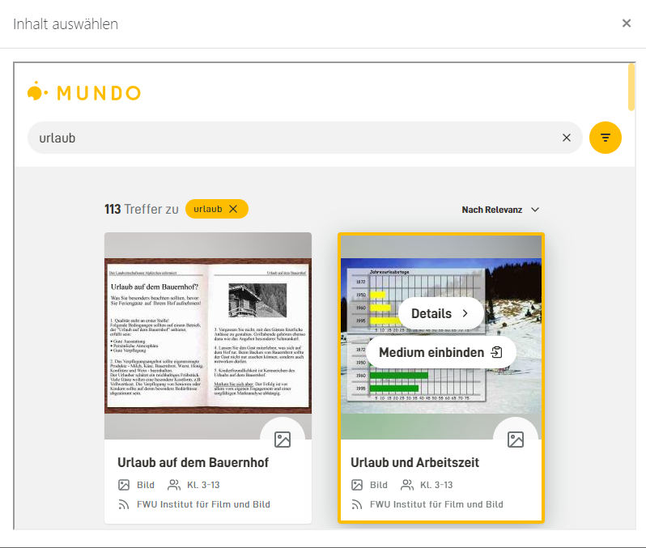

# Mundo Nutzung über LTI

## MUNDO-Medien in Moodle einbinden
Über die MUNDO-LTI-Schnittstelle kannst du in MUNDO vorgestellte Medien auf verschiedene Arten in Moodle nutzen bzw. einbinden. Der einfachste Weg ist es, MUNDO als „Externes Tool“ in deinem Moodle-Kurs zu konfigurieren. Auf diese Weise kannst du direkt aus Moodle heraus in der MUNDO-Mediathek nach Unterrichtsmaterialien suchen und sie anschließend in den Kurs einbinden. Dafür sind einmalig ein paar Einstellungen im Moodle-Kurs notwendig, die wir dir hier zeigen.

### Schritt 1: Moodle konfigurieren

Melde dich in deiner Moodle-Umgebung an und gehe anschließend zu dem Moodle-Kurs, in dem du Medien aus MUNDO nutzen möchtest.

Wähle bei den Kurseinstellungen rechts oben „Bearbeiten einschalten“. Klicke nun wie gewohnt auf „Aktivität oder Material anlegen“.

Bitte wähle als Aufgabenform „Externes Tool“ an und bestätige deine Auswahl mit einem Klick auf „Hinzufügen“: In der ersten Zeile wird ein „Name der Aktivität“ erwartet. Aber wir benennen die Aktivität später. Aktiviere zunächst in der Zeile „Vorkonfiguriertes Tool“ das Plus-Zeichen.

Kopiere nun folgende Kennwörter, Schlüssel und Adressen in die entsprechenden Felder:

Die Tool-URL: https://mundo.schule/lti/
Anwenderschlüssel und öffentliches Kennwort: hier trägst du bitte jeweils "none" ein.
Wichtig: Wähle nun „Mehr anzeigen“ an. Setze schließlich bei „Unterstützt Deep-Linking (Content-ItemMessage)“ den Haken - und klicke auf „Änderungen speichern“. Im Bereich "Datenschutz" kannst du auf Wunsch zusätzlich für "Anwendername an Tool übergeben" und "E-Mail des Anwenders an Tool übergeben" den Eintrag "nie" auswählen.

### Schritt 2: Ein erstes Medium einfügen

Die MUNDO-Mediathek ist jetzt als externes Tool in deinem Kurs integriert und du kannst das erste Medium ber MUNDO in deinen Kurs einbinden. Fülle dazu die erste Zeile „Name der Aktivität“ aus, die wir vorhin freigelassen haben. Unter dem hier eingegebenen Namen erscheint das importierte Material später im Kurs. Diesen Namen musst du nur bei dem ersten Medium, das du einfügst, selbst ergänzen. Bei weiteren Medienimporten erscheinen hier automatisch die Titel der ausgewählten Medien. Du kannst aber auch weiterhin eigene Titel wählen.

Abschließend klickst du auf „Speichern und zum Kurs“. Im Kurs wird die Aktivität jetzt bereits angezeigt.

Um nun ein MUNDO-Medium einzubinden, klickst du in der neu konfigurierten Aktivität auf „Bearbeiten“ und anschließend auf „Einstellungen bearbeiten“.

Aktivere nun per Mausklick den Button „Inhalt auswählen.“ Als Aktivität wird „Link/URL“ ausgewählt.

Nun gelangst du direkt in die MUNDO-Suche. Hast du das passende Medium gefunden kannst du es entweder bereits in der Kachalnsicht oder in der Mediandetailansicht über den Button „Medium einbinden“ in den Moodle-Kurs einbinden.

#### MUNDO-Suche in Moodle

Beende den Vorgang nun wie gewohnt über „Speichern und zum Kurs“.

Damit hast du MUNDO als externes Tool im Moodle-Kurs fertig konfiguriert und das gewünschte Medium eingebunden.

Über den Play-Button gelangen nun alle Teilnehmer des Moodle-Kurses zu dem ausgewählten Medium.

Um weitere MUNDO-Materialien in den Kurs einzubinden, wählst du erneut die Aktivität „Externes Tool“. Wähle in dem Feld „Vorkonfiguriertes Tool“ MUNDO aus. Mit einem Klick auf „Inhalt auswählen“ kommst du wieder direkt zur MUNDO-Suche.

### Pro-Tipp

:::tip[Tipp]
Als Moodle-Administrator kannst du MUNDO systemweit als externes Tool konfigurieren. Damit können alle Trainerinnen und Trainer der Moodle-Instanz die MUNDO-Schnittstelle nutzen.

